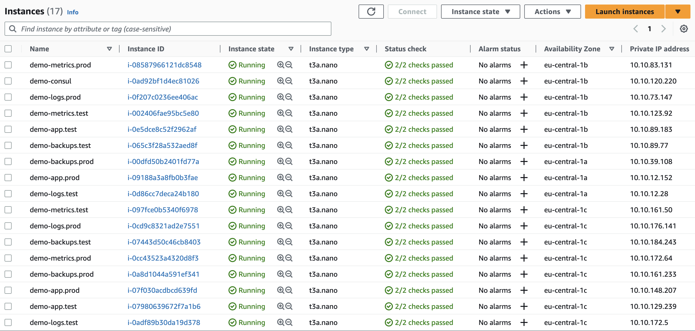
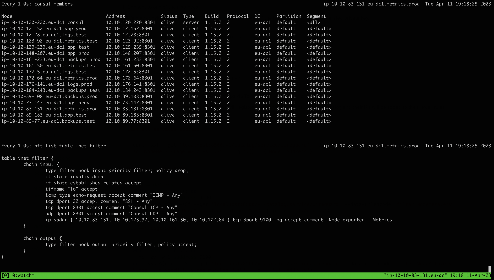

# Exercise

 1. [Description](#description)
 2. [Solution](#solution)
 3. [Requirements](#requirements)
 4. [Deploy](#deploy)
 5. [Check](#check)
 6. [Cleanup](#cleanup)
 7. [Documentation](#documentation)
 8. [Known issues](#known-issues)


## [Description](#exercise)

 This exercise is aimed to check
   - Linux firewalls understanding
   - New solutions research and design
   - Tasks automation
   - Consul catalog knowledge

 We are running fleets with Linux OS with a different number of nodes. All hosts belongs to the same internal network 10.10.0.0/16.

 It is required to implement a solution to update firewall rules in an automated way based on Consul catalog data.

 Access diagram looks like the following

  ```
    metrics.*/9100                          / - metrics.prod - \
    metrics.*/9100                         / -- metrics.test -- \
    metrics.*/9100 | *.*/5141             / --- logs.prod    --- \
    metrics.*/9100 | *.*/5141            / ---- logs.test    ---- \
          Internal (10.10.0.0/16) ---->                            <---- (xx.xx.xx.xx/yy) Public
    metrics.*/9100                       \ ---- backups.prod ---- /
    metrics.*/9100                        \ --- backups.test --- /
    metrics.*/9100,9104 | backups.*/3306   \ -- app.prod     -- /
    metrics.*/9100,9104 | backups.*/3306    \ - app.test     - /
  ```


## [Solution](#exercise)

 **This is just a demo or PoC and we use the following considerations**
 1. We elected AWS as one of the mostly used and easy to use stand
 2. Terraform is used to provision infrastructure
 3. We run very basic network configuration with open internal communication
 4. We run single node Consul cluster with just basic settings
 5. We use AWS Auto Scaling Groups for easiest nodes creation and future checks
 6. We elected nftables for firewall configuration as an successor of iptables and a default tool in Ubuntu
 7. We elected Consul Template as it is a [recomended solution for Consul Service Discovery template engine](https://github.com/hashicorp/consul-template#faq)
 8. We run basic shell script on all fleets nodes to check opened ports

 **This configuration will do the following**
 1. Create a common VPC
 2. Create an IAM roles for all the instances for [Cloud Auto-join](https://developer.hashicorp.com/consul/docs/install/cloud-auto-join)
 3. Create Launch Templates with tags for Cloud Auto-join
 4. Create an Auto Scaling Group for Consul server with a singe node
 5. Create an Auto Scaling Groups for all the fleets with the number of nodes specified in the variables
 6. Install Consul on the Consul server and Consul Template, nftables on all fleets nodes via [Cloud-Init](https://docs.aws.amazon.com/AWSEC2/latest/UserGuide/user-data.html)

 **After instances run, the following will occur**
 1. Consul server will form the cluster and start to serve the clients
 2. Consul client on fleets nodes will join the cluster
 4. Consul client on fleets nodes will register the service
 5. Consul Template will start to monitor nftables rules template file and will render it on Consul Service Catalog changes and new ruleset will be applied to the firewall
  ```
  Start node
    --> Install Consul client
      --> Join Consul cluster
        --> Register node service in Consul catalog
          --> Configure firewall using Consul Template based on the data from Consul service catalog
            --> Monitor Consul service catalog for changes and update firewall configuration automatically
  ```


## [Requirements](#exercise)

 In order to proceed with this deployment, we need
 1. Linux host with [Terraform](https://developer.hashicorp.com/terraform/tutorials/aws-get-started/install-cli) installed
 2. AWS user account with the following programmatic access permissions
      * `AmazonVPCFullAccess`
      * `IAMFullAccess`
      * `AmazonEC2FullAccess`
      * `AmazonS3FullAccess` [`(GitHub Action deploy)`](#github-actions)
 3. Enough [Amazon EC2 service quotas](https://docs.aws.amazon.com/AWSEC2/latest/UserGuide/ec2-resource-limits.html) to run required numbers of instances


## [Deploy](#exercise)

### [Manually](#deploy)

 1. Get the code
    ```bash
    git clone https://github.com/st38/exercise-20230406-do

    cd exercise-20230406-do/aws
    ```

 2. Authenticate on AWS
    ```bash
    export AWS_ACCESS_KEY_ID="<access key>"
    export AWS_SECRET_ACCESS_KEY="<secret access key>"
    export AWS_REGION="eu-west-3"
    ```

 3. Adjust variables
    ```bash
    vi variables.auto.tfvars
    ```

 4. Run Terraform
    ```bash
    # Initialize
    terraform init

    # Plan
    terraform plan

    # Apply
    terraform apply
    ```

 After ~ 2 minutes nodes will finish configuration and we are ready to [check](#check) the results
  <details>
  <summary>Screenshot</summary>

  
  </details>


### [GitHub Actions](#deploy)

 1. Fork the repository

 2. Add GitHub Actions Secrets
    | Secret name             | Secret value           | Description                   |
    | ----------------------- | ---------------------- | ----------------------------- |
    | `AWS_ACCESS_KEY_ID`     | `<access key>`         | IAM User for deployment       |
    | `AWS_SECRET_ACCESS_KEY` | `<secret access key>`  | IAM User  for deployment      |
    | `AWS_REGION`            | `<aws region>`         | Region where to run instances |
    | `S3_BUCKET`             | `<s3 bucket>`          | S3 bucket for Terraform state |
    | `S3_BUCKET_REGION`      | `<s3 bucket region>`   | S3 bucket region              |

 3. Run [Deploy workflow](../../actions/workflows/deploy.yaml) to deploy resources

 4. [Check](#check) the results

 5. Run [Cleanup workflow](../../actions/workflows/cleanup.yaml) to cleanup resources


## [Check](#exercise)

 1. Connect to one of the instances

    We may consider to use [EC2 Instance Connect](https://docs.aws.amazon.com/AWSEC2/latest/UserGuide/ec2-instance-connect-methods.html) and in case of the issue, we should use generated private key

    <details>
    <summary>Connect using generated private key</summary>

    We generate a custom private key which is stored in Terraform state and if we would like to connect to the instance, we should get it from the state and use for the SSH connection
    ```bash
    # Variables
    username="ubuntu"
    private_key="aws_private_key.pem"
    public_ip="<instance public ip>"

    # Get private key
    terraform output -raw private_key >"${private_key}"
    chmod 600 "${private_key}"

    # Connect to the instance
    ssh  -i "${private_key}" "${username}"@"${public_ip}"
    ```
    </details>

 2. Check nodes registered in Consul and firewall rules
    ```bash
    # Consul members
    watch -n 1 consul members

    # nftables rules
    watch -n 1 nft list table inet filter
    ```
    <details>
    <summary>Screenshot</summary>

    
    </details>

 3. Increase nodes count in the Auto Scaling Groups via Terrafrom or AWS Console

    In ~ 2 minutes we may check that new nodes will register their service in Consul service catalog and their IPs will be added to the firewall rules

 4. Check ports connections

    **`List all services address`**
    ```bash
    curl -sSf --get 'localhost:8500/v1/catalog/service/wireguard' --data-urlencode 'filter=NodeMeta.env matches ".*" and NodeMeta.stage matches ".*"' | jq '.[] | { Node, Address }'
    ```
    <details>
    <summary>result</summary>

    ```json
    {
      "Node": "ip-10-10-12-152.eu-dc1.app.prod",
      "Address": "10.10.12.152"
    }
    {
      "Node": "ip-10-10-12-28.eu-dc1.logs.test",
      "Address": "10.10.12.28"
    }
    {
      "Node": "ip-10-10-123-92.eu-dc1.metrics.test",
      "Address": "10.10.123.92"
    }
    {
      "Node": "ip-10-10-129-239.eu-dc1.app.test",
      "Address": "10.10.129.239"
    }
    {
      "Node": "ip-10-10-148-207.eu-dc1.app.prod",
      "Address": "10.10.148.207"
    }
    {
      "Node": "ip-10-10-161-233.eu-dc1.backups.prod",
      "Address": "10.10.161.233"
    }
    {
      "Node": "ip-10-10-161-50.eu-dc1.metrics.test",
      "Address": "10.10.161.50"
    }
    {
      "Node": "ip-10-10-172-5.eu-dc1.logs.test",
      "Address": "10.10.172.5"
    }
    {
      "Node": "ip-10-10-172-64.eu-dc1.metrics.prod",
      "Address": "10.10.172.64"
    }
    {
      "Node": "ip-10-10-176-141.eu-dc1.logs.prod",
      "Address": "10.10.176.141"
    }
    {
      "Node": "ip-10-10-184-243.eu-dc1.backups.test",
      "Address": "10.10.184.243"
    }
    {
      "Node": "ip-10-10-39-108.eu-dc1.backups.prod",
      "Address": "10.10.39.108"
    }
    {
      "Node": "ip-10-10-73-147.eu-dc1.logs.prod",
      "Address": "10.10.73.147"
    }
    {
      "Node": "ip-10-10-83-131.eu-dc1.metrics.prod",
      "Address": "10.10.83.131"
    }
    {
      "Node": "ip-10-10-89-183.eu-dc1.app.test",
      "Address": "10.10.89.183"
    }
    {
      "Node": "ip-10-10-89-77.eu-dc1.backups.test",
      "Address": "10.10.89.77"
    }
    ```
    </details>

    **`Metrics --> ALL/9100`**
    ```bash
    # From Metrics - succeeded
    while read address; do
      nc -zv -w 1 $address 9100
    done <<< $(curl -sSf --get 'localhost:8500/v1/catalog/service/wireguard' --data-urlencode 'filter=NodeMeta.env matches ".*" and NodeMeta.stage matches ".*"' | jq -r '.[].Address')
    ```
    <details>
    <summary>result</summary>

    ```bash
    Connection to 10.10.12.152 9100 port [tcp/*] succeeded!
    Connection to 10.10.12.28 9100 port [tcp/*] succeeded!
    Connection to 10.10.123.92 9100 port [tcp/*] succeeded!
    Connection to 10.10.129.239 9100 port [tcp/*] succeeded!
    Connection to 10.10.148.207 9100 port [tcp/*] succeeded!
    Connection to 10.10.161.233 9100 port [tcp/*] succeeded!
    Connection to 10.10.161.50 9100 port [tcp/*] succeeded!
    Connection to 10.10.172.5 9100 port [tcp/*] succeeded!
    Connection to 10.10.172.64 9100 port [tcp/*] succeeded!
    Connection to 10.10.176.141 9100 port [tcp/*] succeeded!
    Connection to 10.10.184.243 9100 port [tcp/*] succeeded!
    Connection to 10.10.39.108 9100 port [tcp/*] succeeded!
    Connection to 10.10.73.147 9100 port [tcp/*] succeeded!
    Connection to 10.10.83.131 9100 port [tcp/*] succeeded!
    Connection to 10.10.89.183 9100 port [tcp/*] succeeded!
    Connection to 10.10.89.77 9100 port [tcp/*] succeeded!
    ```
    </details>

    **`ALL --> Logs/5141`**
    ```bash
    # From Metrics - succeeded
    while read address; do
      nc -zv -w 1 $address 5141
    done <<< $(curl -sSf --get 'localhost:8500/v1/catalog/service/wireguard' --data-urlencode 'filter=NodeMeta.env == "logs" and NodeMeta.stage matches ".*"' | jq -r '.[].Address')
    ```
    <details>
    <summary>result</summary>

    ```bash
    Connection to 10.10.12.28 5141 port [tcp/*] succeeded!
    Connection to 10.10.172.5 5141 port [tcp/*] succeeded!
    Connection to 10.10.176.141 5141 port [tcp/*] succeeded!
    Connection to 10.10.73.147 5141 port [tcp/*] succeeded!
    ```
    </details>

    **`Metrics --> App/9104`**
    ```bash
    # From Metrics - succeeded
    while read address; do
      nc -zv -w 1 $address 9104
    done <<< $(curl -sSf --get 'localhost:8500/v1/catalog/service/wireguard' --data-urlencode 'filter=NodeMeta.env == "app" and NodeMeta.stage matches ".*"' | jq -r '.[].Address')
    ```
    <details>
    <summary>result</summary>

    ```bash
    Connection to 10.10.12.152 9104 port [tcp/*] succeeded!
    Connection to 10.10.129.239 9104 port [tcp/*] succeeded!
    Connection to 10.10.148.207 9104 port [tcp/*] succeeded!
    Connection to 10.10.89.183 9104 port [tcp/*] succeeded!
    ```
    </details>

    **`Backups --> App/3306`**
    ```bash
    # From Backups - succeeded
    while read address; do
      nc -zv -w 1 $address 3306
    done <<< $(curl -sSf --get 'localhost:8500/v1/catalog/service/wireguard' --data-urlencode 'filter=NodeMeta.env == "app" and NodeMeta.stage matches ".*"' | jq -r '.[].Address')
    ```
    <details>
    <summary>result</summary>

    ```bash
    Connection to 10.10.12.152 3306 port [tcp/mysql] succeeded!
    Connection to 10.10.129.239 3306 port [tcp/mysql] succeeded!
    Connection to 10.10.148.207 3306 port [tcp/mysql] succeeded!
    Connection to 10.10.89.183 3306 port [tcp/mysql] succeeded!
    ```
    </details>

    **`Metrics -x- App/3306`**
    ```bash
    # From Metrics - timed out
    while read address; do
      nc -zv -w 1 $address 3306
    done <<< $(curl -sSf --get 'localhost:8500/v1/catalog/service/wireguard' --data-urlencode 'filter=NodeMeta.env == "app" and NodeMeta.stage matches ".*"' | jq -r '.[].Address')
    ```
    <details>
    <summary>result</summary>

    ```bash
    nc: connect to 10.10.12.152 port 3306 (tcp) timed out: Operation now in progress
    nc: connect to 10.10.129.239 port 3306 (tcp) timed out: Operation now in progress
    nc: connect to 10.10.148.207 port 3306 (tcp) timed out: Operation now in progress
    nc: connect to 10.10.89.183 port 3306 (tcp) timed out: Operation now in progress
    ```
    </details>


 5. Query Consul service catalog
    ```bash
    # All services
    curl -sSf --get 'localhost:8500/v1/catalog/service/wireguard' | \
      jq '.[] | { ID, Address, Node, Datacenter, NodeMeta, ServiceID, ServiceName, ServiceTags, ServiceAddress, ServicePort}'
    ```
    <details>
    <summary>Service catalog output</summary>

    ```json
    {
      "ID": "60a3c285-4ffa-3878-318e-2fc305802220",
      "Address": "10.10.12.152",
      "Node": "ip-10-10-12-152.eu-dc1.app.prod",
      "Datacenter": "eu-dc1",
      "NodeMeta": {
        "consul-network-segment": "",
        "env": "app",
        "stage": "prod"
      },
      "ServiceID": "wireguard",
      "ServiceName": "wireguard",
      "ServiceTags": [
        "eu-dc1",
        "app.prod",
        "wireguard",
        "vpn"
      ],
      "ServiceAddress": "10.10.12.152",
      "ServicePort": 51820
    }
    {
      "ID": "f5e37fa9-5242-d60c-4538-782618cdab73",
      "Address": "10.10.12.28",
      "Node": "ip-10-10-12-28.eu-dc1.logs.test",
      "Datacenter": "eu-dc1",
      "NodeMeta": {
        "consul-network-segment": "",
        "env": "logs",
        "stage": "test"
      },
      "ServiceID": "wireguard",
      "ServiceName": "wireguard",
      "ServiceTags": [
        "eu-dc1",
        "logs.test",
        "wireguard",
        "vpn"
      ],
      "ServiceAddress": "10.10.12.28",
      "ServicePort": 51820
    }
    {
      "ID": "6abcb30f-6933-0d51-938c-818809e805ca",
      "Address": "10.10.123.92",
      "Node": "ip-10-10-123-92.eu-dc1.metrics.test",
      "Datacenter": "eu-dc1",
      "NodeMeta": {
        "consul-network-segment": "",
        "env": "metrics",
        "stage": "test"
      },
      "ServiceID": "wireguard",
      "ServiceName": "wireguard",
      "ServiceTags": [
        "eu-dc1",
        "metrics.test",
        "wireguard",
        "vpn"
      ],
      "ServiceAddress": "10.10.123.92",
      "ServicePort": 51820
    }
    {
      "ID": "ad13f1fb-1e87-cf89-aa62-9e27c08dfe36",
      "Address": "10.10.129.239",
      "Node": "ip-10-10-129-239.eu-dc1.app.test",
      "Datacenter": "eu-dc1",
      "NodeMeta": {
        "consul-network-segment": "",
        "env": "app",
        "stage": "test"
      },
      "ServiceID": "wireguard",
      "ServiceName": "wireguard",
      "ServiceTags": [
        "eu-dc1",
        "app.test",
        "wireguard",
        "vpn"
      ],
      "ServiceAddress": "10.10.129.239",
      "ServicePort": 51820
    }
    {
      "ID": "d26ace65-6161-e29e-da52-e4d5caa0c1ff",
      "Address": "10.10.148.207",
      "Node": "ip-10-10-148-207.eu-dc1.app.prod",
      "Datacenter": "eu-dc1",
      "NodeMeta": {
        "consul-network-segment": "",
        "env": "app",
        "stage": "prod"
      },
      "ServiceID": "wireguard",
      "ServiceName": "wireguard",
      "ServiceTags": [
        "eu-dc1",
        "app.prod",
        "wireguard",
        "vpn"
      ],
      "ServiceAddress": "10.10.148.207",
      "ServicePort": 51820
    }
    {
      "ID": "358cc1c8-7eb4-ac66-79bc-a224cdbe362b",
      "Address": "10.10.161.233",
      "Node": "ip-10-10-161-233.eu-dc1.backups.prod",
      "Datacenter": "eu-dc1",
      "NodeMeta": {
        "consul-network-segment": "",
        "env": "backups",
        "stage": "prod"
      },
      "ServiceID": "wireguard",
      "ServiceName": "wireguard",
      "ServiceTags": [
        "eu-dc1",
        "backups.prod",
        "wireguard",
        "vpn"
      ],
      "ServiceAddress": "10.10.161.233",
      "ServicePort": 51820
    }
    {
      "ID": "a1faf0b8-e63c-f23e-0137-afde127bd5cb",
      "Address": "10.10.161.50",
      "Node": "ip-10-10-161-50.eu-dc1.metrics.test",
      "Datacenter": "eu-dc1",
      "NodeMeta": {
        "consul-network-segment": "",
        "env": "metrics",
        "stage": "test"
      },
      "ServiceID": "wireguard",
      "ServiceName": "wireguard",
      "ServiceTags": [
        "eu-dc1",
        "metrics.test",
        "wireguard",
        "vpn"
      ],
      "ServiceAddress": "10.10.161.50",
      "ServicePort": 51820
    }
    {
      "ID": "743931f6-ccee-6ddb-1d9f-f3b8081fd8f5",
      "Address": "10.10.172.5",
      "Node": "ip-10-10-172-5.eu-dc1.logs.test",
      "Datacenter": "eu-dc1",
      "NodeMeta": {
        "consul-network-segment": "",
        "env": "logs",
        "stage": "test"
      },
      "ServiceID": "wireguard",
      "ServiceName": "wireguard",
      "ServiceTags": [
        "eu-dc1",
        "logs.test",
        "wireguard",
        "vpn"
      ],
      "ServiceAddress": "10.10.172.5",
      "ServicePort": 51820
    }
    {
      "ID": "68c32fb1-b81d-f314-8136-9197ad3a7b52",
      "Address": "10.10.172.64",
      "Node": "ip-10-10-172-64.eu-dc1.metrics.prod",
      "Datacenter": "eu-dc1",
      "NodeMeta": {
        "consul-network-segment": "",
        "env": "metrics",
        "stage": "prod"
      },
      "ServiceID": "wireguard",
      "ServiceName": "wireguard",
      "ServiceTags": [
        "eu-dc1",
        "metrics.prod",
        "wireguard",
        "vpn"
      ],
      "ServiceAddress": "10.10.172.64",
      "ServicePort": 51820
    }
    {
      "ID": "573522c2-4df4-128c-7d2e-7d7c6a152891",
      "Address": "10.10.176.141",
      "Node": "ip-10-10-176-141.eu-dc1.logs.prod",
      "Datacenter": "eu-dc1",
      "NodeMeta": {
        "consul-network-segment": "",
        "env": "logs",
        "stage": "prod"
      },
      "ServiceID": "wireguard",
      "ServiceName": "wireguard",
      "ServiceTags": [
        "eu-dc1",
        "logs.prod",
        "wireguard",
        "vpn"
      ],
      "ServiceAddress": "10.10.176.141",
      "ServicePort": 51820
    }
    {
      "ID": "15423725-e7b4-a78e-39de-9f4c8f34f0f5",
      "Address": "10.10.184.243",
      "Node": "ip-10-10-184-243.eu-dc1.backups.test",
      "Datacenter": "eu-dc1",
      "NodeMeta": {
        "consul-network-segment": "",
        "env": "backups",
        "stage": "test"
      },
      "ServiceID": "wireguard",
      "ServiceName": "wireguard",
      "ServiceTags": [
        "eu-dc1",
        "backups.test",
        "wireguard",
        "vpn"
      ],
      "ServiceAddress": "10.10.184.243",
      "ServicePort": 51820
    }
    {
      "ID": "3848e9cb-811a-f03b-562f-27e0d0cf53f6",
      "Address": "10.10.39.108",
      "Node": "ip-10-10-39-108.eu-dc1.backups.prod",
      "Datacenter": "eu-dc1",
      "NodeMeta": {
        "consul-network-segment": "",
        "env": "backups",
        "stage": "prod"
      },
      "ServiceID": "wireguard",
      "ServiceName": "wireguard",
      "ServiceTags": [
        "eu-dc1",
        "backups.prod",
        "wireguard",
        "vpn"
      ],
      "ServiceAddress": "10.10.39.108",
      "ServicePort": 51820
    }
    {
      "ID": "6a53a986-f313-ec6a-0e69-59c939f56810",
      "Address": "10.10.73.147",
      "Node": "ip-10-10-73-147.eu-dc1.logs.prod",
      "Datacenter": "eu-dc1",
      "NodeMeta": {
        "consul-network-segment": "",
        "env": "logs",
        "stage": "prod"
      },
      "ServiceID": "wireguard",
      "ServiceName": "wireguard",
      "ServiceTags": [
        "eu-dc1",
        "logs.prod",
        "wireguard",
        "vpn"
      ],
      "ServiceAddress": "10.10.73.147",
      "ServicePort": 51820
    }
    {
      "ID": "d44b328b-114a-6170-e074-608587e1c236",
      "Address": "10.10.83.131",
      "Node": "ip-10-10-83-131.eu-dc1.metrics.prod",
      "Datacenter": "eu-dc1",
      "NodeMeta": {
        "consul-network-segment": "",
        "env": "metrics",
        "stage": "prod"
      },
      "ServiceID": "wireguard",
      "ServiceName": "wireguard",
      "ServiceTags": [
        "eu-dc1",
        "metrics.prod",
        "wireguard",
        "vpn"
      ],
      "ServiceAddress": "10.10.83.131",
      "ServicePort": 51820
    }
    {
      "ID": "493f1b03-269f-d0a7-6968-5eef0490d112",
      "Address": "10.10.89.183",
      "Node": "ip-10-10-89-183.eu-dc1.app.test",
      "Datacenter": "eu-dc1",
      "NodeMeta": {
        "consul-network-segment": "",
        "env": "app",
        "stage": "test"
      },
      "ServiceID": "wireguard",
      "ServiceName": "wireguard",
      "ServiceTags": [
        "eu-dc1",
        "app.test",
        "wireguard",
        "vpn"
      ],
      "ServiceAddress": "10.10.89.183",
      "ServicePort": 51820
    }
    {
      "ID": "7dc237fc-9d4d-10b5-835c-5c541c9f334a",
      "Address": "10.10.89.77",
      "Node": "ip-10-10-89-77.eu-dc1.backups.test",
      "Datacenter": "eu-dc1",
      "NodeMeta": {
        "consul-network-segment": "",
        "env": "backups",
        "stage": "test"
      },
      "ServiceID": "wireguard",
      "ServiceName": "wireguard",
      "ServiceTags": [
        "eu-dc1",
        "backups.test",
        "wireguard",
        "vpn"
      ],
      "ServiceAddress": "10.10.89.77",
      "ServicePort": 51820
    }
    ```
    </details>


## [Cleanup](#exercise)

 After we finished testing, we should cleanup all created resources
 1. Cleanup resources
    ```bash
    # Destroy
    terraform destroy

    # Private key
    # rm -f aws_private_key.pem
    ```


## [Documentation](#exercise)

 1. [Consul Reference Architecture](https://developer.hashicorp.com/consul/tutorials/production-deploy/reference-architecture)
 2. [Deployment Guide](https://developer.hashicorp.com/consul/tutorials/production-deploy/deployment-guide)
 3. [Agents Configuration File Reference](https://developer.hashicorp.com/consul/docs/agent/config/config-files)
 4. [Cloud Auto-join](https://developer.hashicorp.com/consul/docs/install/cloud-auto-join)
 5. [Define services](https://developer.hashicorp.com/consul/docs/services/usage/define-services)
 6. [Consul Commands (CLI)](https://developer.hashicorp.com/consul/commands)
 7. [Filtering](https://developer.hashicorp.com/consul/api-docs/features/filtering)
 8. [Service Configuration with Consul Template](https://developer.hashicorp.com/consul/tutorials/developer-configuration/consul-template)
 9. [nftables HOWTO documentation page](https://wiki.nftables.org/wiki-nftables/index.php/Main_Page)
 10. [Quick reference-nftables in 10 minutes](https://wiki.nftables.org/wiki-nftables/index.php/Quick_reference-nftables_in_10_minutes)


## [Known issues](#exercise)

 1. Sometimes Terraform may fail to create Auto Scaling Group - [[Bug]: Invalid IAM Instance Profile ARN when creating ASG using launch template #29866](https://github.com/hashicorp/terraform-provider-aws/issues/29866)
